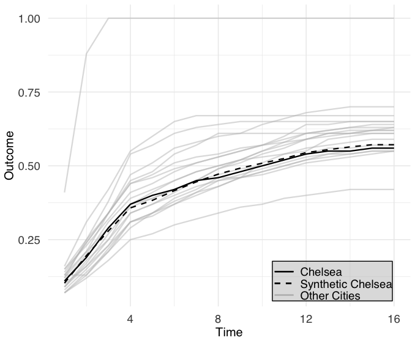
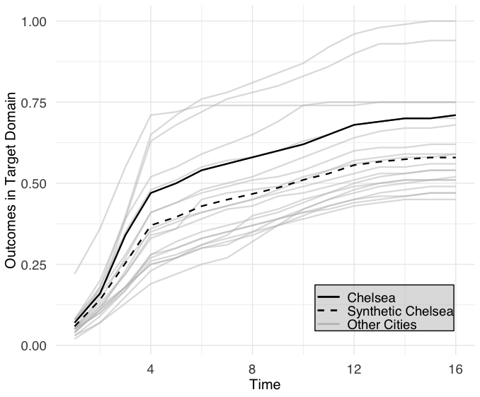
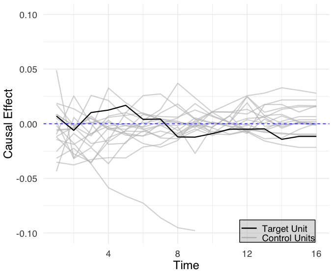
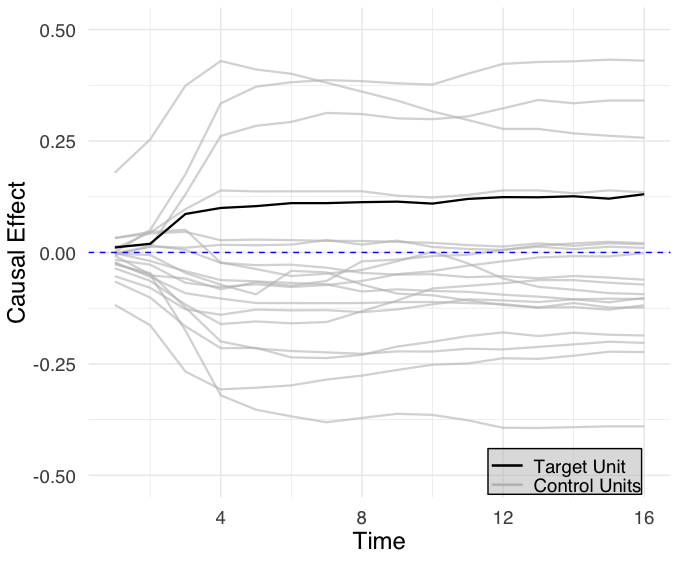

# causalfusion 

**CausalFusion** is an R package for estimating causal effects when pre-intervention data in the target domain is missing or incomplete. It introduces **three data fusion methods** that leverage auxiliary panel data from related reference domains to estimate treatment effects in the target domain.

These methods overcome the limitations of conventional synthetic control by recovering counterfactual outcomes even in the absence of pre-treatment information.

### 🔍 Included Methods

- **Linear Equi-Confounding**  
- **Logarithmic Equi-Confounding**  
- **Synthetic Control Data Fusion**

Each method encodes structural assumptions across domains and solves for synthetic control weights using constrained optimization with interpretable hyperparameters.

📄 Read the full theory paper on arXiv: [arXiv:2410.16391](https://arxiv.org/abs/2410.16391)

---

## 🚀 Installation

You can install the development version directly from GitHub:

```r
# Install devtools if you haven't already
install.packages("devtools")

# Install causalfusion from GitHub
devtools::install_github("ZouYang31/causalfusion")

```
## 📚 Load the Package

```r
library(causalfusion)
```

## 📦 Usage

The `causalfusion` package provides a streamlined pipeline to generate synthetic controls for causal inference. Below is a typical workflow:

| Function              | Description |
|-----------------------|-------------|
| `normalize_columns()` | Min-max scaling for numeric covariates. |
| `reorder_unit_first()` | Moves treated unit(s) to the top of the dataset. |
| `covariates_matrix()` | Converts selected covariates into a matrix format for modeling. |
| `outcome_matrix()` | Converts long or wide data into a unit-by-time matrix format. |
| `generate_b_list()` | Generates all valid combinations of weights (`b_F`, `b_Z`, `b_X`) that sum to 1 for the fusion model. |
| `optimize_w_ipop()` | Optimizes weights for control units using quadratic programming (`ipop`) to best match treated. |
| `NSE_x()` | Calculates Normalized Squared Error to assess match quality in `X` or `Z` space. |
| `find_best_B()` | Searches for the best fusion weights (`b_F`, `b_Z`, `b_X`) minimizing deviation from baselines. |
| `sc_ett()`                      | Calculates the Estimated Treatment Effect (ETT) using the synthetic control data fusion method. |
| `linear_equi_confounding_ett()` | Computes the ETT assuming a **linear equi-confounding** structure between treated and control units. |
| `log_equi_confounding_ett()`    | Computes the ETT assuming a **logarithmic equi-confounding** structure between treated and control units. |


## Example Usage with real data
Example datasets used for testing and demonstration are located in the `data/` folder. These include:

- `final_transformed_data_20cities_v2.csv`: Yearly demographic and outcome data for 20 cities.
- `monthly_covid_vaccination_rate_20cities_v2.csv`: Monthly COVID vaccination rates for the same cities.

These files are used in the examples throughout the package and can be loaded using standard R functions:

```r
# Load the package
library(causalfusion)
library(dplyr)

# Load data
covid_demo_yr <- read.csv("data/yearly_covariates_data_20cities.csv")
covid_vac_mo <- read.csv("data/monthly_covid_vaccination_data.csv")

# Prioritize treated unit to appear first
df_reordered_hispanic <- reorder_unit_first(covid_demo_yr, "Chelsea-hispanic")
df_reordered_black <- reorder_unit_first(covid_demo_yr, "Chelsea-black")

# Separate domains
df_black <- df_reordered_black %>% filter(grepl("-black", unit))
df_hispanic <- df_reordered_hispanic %>% filter(grepl("-hispanic", unit))

# Normalize covariates
df_black <- normalize_columns(df_black, c("median_income","median_age","proportion","X65p_proportion"))
df_hispanic <- normalize_columns(df_hispanic, c("median_income","median_age","proportion","X65p_proportion"))

# Filter for analysis year
df_black <- df_black %>% filter(year == 2021)
df_hispanic <- df_hispanic %>% filter(year == 2021)

df_black_mo <- covid_vac_mo %>%
  filter(grepl("-black", unit)) %>%
  reorder_unit_first("Chelsea-black")  # Uses pre-defined function

df_hispanic_mo <- covid_vac_mo %>%
  filter(grepl("-hispanic", unit)) %>%
  reorder_unit_first("Chelsea-hispanic")  # Uses pre-defined function

df_black_mo <- df_black_mo %>%
  filter(year_month < "2022-07")

df_hispanic_mo <- df_hispanic_mo %>%
  filter(year_month < "2022-07")


# Convert to matrix format
Z <- covariates_matrix(df_black, c("median_income","median_age","proportion","X65p_proportion"), "unit")
X <- covariates_matrix(df_hispanic, c("median_income","median_age","proportion","X65p_proportion"), "unit")
F <- outcome_matrix(df_black_mo, colname_outcome_var = "fully_vac_rate", colname_unit = "unit", colname_time = "year_month")
Y <- outcome_matrix(df_hispanic_mo, colname_outcome_var = "fully_vac_rate",colname_unit = "unit", colname_time = "year_month")

num_city <- 20   # Total number of cities
J <- num_city - 1 # Control units
w <- rep(0, J)    # Initialize weight vector

#Extract treated and control components
Y_treated <- Y[1, ]
Y_control <- Y[2:(J + 1), ]

F_treated <- F[1, ]
F_control <- F[2:(J + 1), ]

Z_treated <- Z[1, ]
Z_control <- Z[2:(J + 1), ]

X_treated <- X[1, ]
X_control <- X[2:(J + 1), ]

# Number of unique time points in vaccination data
t_max <- length(Y_treated)
s_max <- length(F_treated)


# Number of covariates in reference and target domains
dr <- length(Z_treated)   # Reference domain covariates
dt <- length(X_treated)  # Target domain covariates

# Generate candidate weight combinations
B <- generate_b_list(step = 0.01, min_value = 0.01)

# Compute baseline errors
result_X <- optimize_w_ipop(X = X, n_X = dt, i_max = num_city,
                            margin.ipop = 1e-4, sigf.ipop = 5, bound.ipop = 10)

wX <- result_X$weights
NSE_X_baseline <- NSE_x(w = wX, F= F, X= X, Z= Z, t_max, dr, dt, i_max=num_city, target = "X")
print(NSE_X_baseline)


result_Z <- optimize_w_ipop(X = Z, n_X = dr, i_max = num_city,
                            margin.ipop = 1e-4, sigf.ipop = 5, bound.ipop = 10)

wZ <- result_Z$weights
NSE_Z_baseline <- NSE_x(w = wZ,  F = F, X = X, Z = Z, t_max, dr, dt, i_max=num_city, target = "Z")
print(NSE_Z_baseline)

# Optimize Best B
b_list <- find_best_B(
  B = B,
  F_treated = F_treated,
  F_control = F_control,
  X_treated = X_treated,
  X_control = X_control,
  Z_treated = Z_treated,
  Z_control = Z_control,
  t_max = t_max,
  dr = dr,
  dt = dt,
  i_max = num_city,
  NSE_Z_baseline = NSE_Z_baseline,
  NSE_X_baseline = NSE_X_baseline,
  eta_Z = 0.1,
  eta_X = 0.1
)


# Solve for weight vector (w) using the optimal B values
w <- b_list$best_w_star

# Generate Graphs for Reference and Target Domains
synthetic_reference_plot_real_data(F = F, w = w, t_max = t_max, i_max = num_city, J = J,
                                   title = NULL,
                                   x_label = "Time",
                                   y_label = "Outcome",
                                   legend_labels = c("Chelsea", "Synthetic Chelsea", "Other Cities"))


synthetic_target_plot_real_data(Y = Y, w = w, s_max = s_max, i_max = num_city, J = J,
                                title = NULL,
                                x_label = "Time",
                                y_label = "Outcomes in Target Domain",
                                legend_labels = c("Chelsea", "Synthetic Chelsea", "Other Cities"))


# Compute Estimated Treatment Effect (ETT) for Synthetic Control

# Calculate the Estimated Treatment Effect (ETT)
ett_synthetic <- sc_ett(Y_treated, Y = Y, w = w, J = J)

# Display the result
cat("Estimated Treatment Effect (ETT) using the synthetic control data fusion method:",
    round(mean(ett_synthetic), 5), "\n")


# Calculate the Estimated Treatment Effect (ETT)
ett_linear <- linear_equi_confounding_ett(Y_treated, Y_control, F_treated, F_control)
cat("Estimated Treatment Effect (ETT) using linear equi-confounding:", round(ett_linear, 5), "\n")

ett_log <- log_equi_confounding_ett(Y_treated, Y_control, F_treated, F_control)
cat("Estimated Treatment Effect (ETT) using logarithm equi-confounding:", round(ett_log, 5), "\n")


# Generate placebo test
placebo_test(B, F, Y, t_max, s_max, i_max = num_city,
             w, X, Z, dr, dt,
             eta_Z = 0.1, eta_X = 0.1,
             Ylab = c("Causal Effect"),
             Xlab = c("Time"),
             ref_lim = c(-0.1, 0.1),
             tar_lim = c(-0.5, 0.5),
             Tunit_lab = c("Target Unit"),
             Cunit_lab = c("Control Units") )

```

## 📈 Graphs

This project includes visualizations of synthetic control and equi-confounding results. All output graphs are stored in the `graphs/` directory.

- `reference_domain_plot.png`: Visualization of covariate balancing and synthetic fit for reference units.
- `target_domain_plot.png`: Visualization of estimated outcomes and treatment effects in the target domain.
- `reference_placebo_test_plot.png`: Visualization of estimated outcomes and treatment effects in the target domain.
- `target_placebo_test_plot.png`: Visualization of covariate balancing and synthetic fit for reference units.

### Example: Synthetic Reference Domain Plot



Make sure to run the analysis pipeline end-to-end to regenerate updated plots based on your input data.

### Example: Synthetic Target Domain Plot



Make sure to run the analysis pipeline end-to-end to regenerate updated plots based on your input data.


### Example: Reference Placebo Test Plot




### Example: Target Placebo Test Plot




